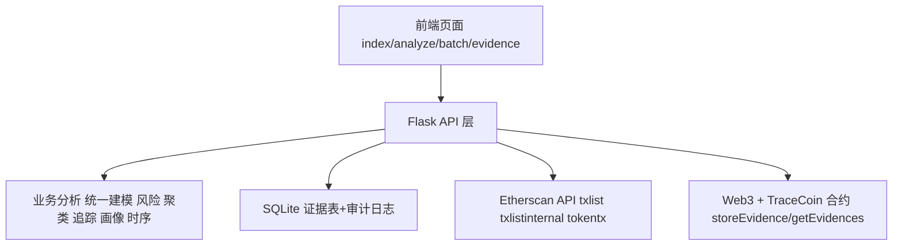
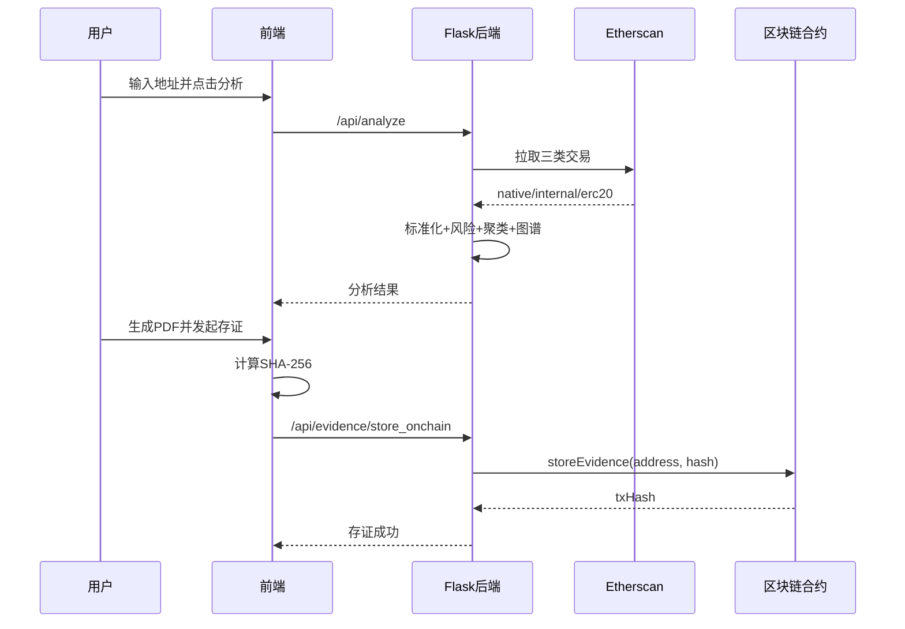

# 基于区块链的虚拟货币溯源及存证系统设计与实现（修订稿）

## 第三章 系统需求分析

### 3.1 功能需求
系统需要支持以下核心功能：
1. **交易数据采集与统一建模**：同时接入 `native`、`internal`、`erc20` 三类交易。
2. **交易关系可视化分析**：构建地址关系图谱，支持节点点击钻取。
3. **地址风险评估**：输出风险分值、风险等级和告警项。
4. **地址聚类分析**：输出簇标签、簇内规模、交互强度。
5. **一跳资金追踪**：按流入/流出方向追踪直接对手地址。
6. **地址画像分析**：输出交易活跃度、对手分布、资产构成。
7. **时序分析**：按日期统计 ETH 主序列和分币种序列。
8. **报告生成与存证**：生成 PDF 报告，计算哈希并上链存证。
9. **存证验真与历史查询**：按地址、交易哈希、区块号反查存证。

### 3.2 非功能需求
1. **可靠性**
   - 第三方接口异常时系统需给出可解释错误，不可无响应。
   - 链上写入需检查 `receipt.status`，失败必须回滚业务状态。
2. **性能**
   - 单地址分析响应时间控制在可交互范围（演示环境通常 < 5 秒，受外部 API 波动影响）。
   - 前端图谱渲染支持中等规模节点集的流畅交互。
3. **安全性**
   - 私钥通过环境变量管理，不写入源码。
   - 所有输入地址、哈希、区块号必须做格式校验。
   - 仅上链哈希，不上链原始 PDF 内容，减少隐私泄露。
4. **可维护性**
   - 后端按“数据采集-分析-存证”模块化拆分函数。
   - 页面按功能分离，主分析页整合子功能，降低跳转复杂度。
5. **可扩展性**
   - 可新增链种或数据源（替换 `etherscan_request` 层）。
   - 可替换风险规则为机器学习模型。
6. **可审计性**
   - 本地 SQLite 保留证据记录与审计日志，支持链上链下双通道核验。

---

## 第四章 系统总体设计

### 4.1 系统总体架构图


### 4.2 关键流程图（分析与存证闭环）


### 4.3 数据模型说明表
| 数据对象 | 关键字段 | 说明 |
|---|---|---|
| 标准交易对象 | hash, from, to, direction, counterparty, value_eth, asset_symbol, asset_type, fee_eth, time_text | 三类交易统一后的公共结构 |
| 聚类结果 | cluster_id, label, size, interaction_count, avg_tx_per_address | 地址分簇及可解释指标 |
| 风险结果 | score, level, alerts | 风险评分与告警项 |
| 存证记录 | address, report_hash, chain_tx_hash, created_at | 报告哈希上链与本地登记 |

---

## 第五章 系统实现

### 5.1 三类交易统一处理（重点）

#### 5.1.1 功能讲解
系统不是只抓普通交易，而是把三类交易统一接入：
- `native`：普通主币交易（`txlist`）
- `internal`：内部交易（`txlistinternal`）
- `erc20`：代币交易（`tokentx`）

统一策略如下：
1. 分源抓取；
2. 映射统一字段（含 `asset_symbol`、`asset_type`）；
3. ERC20 用 `tokenDecimal` 换算真实金额；
4. 按 `asset_type + hash + trace_id` 去重；
5. 排序并进入后续分析流程。

#### 5.1.2 对应代码
```python
# app.py

def etherscan_fetch(address: str, limit: int) -> list[dict[str, Any]]:
    normal_rows = etherscan_request("txlist", address, limit)
    internal_rows = etherscan_request("txlistinternal", address, limit)
    token_rows = etherscan_request("tokentx", address, limit)

    merged: list[dict[str, Any]] = []

    for row in normal_rows:
        merged.append({
            "hash": row.get("hash", ""),
            "from": row.get("from", ""),
            "to": row.get("to", ""),
            "value": row.get("value", "0"),
            "gasPrice": row.get("gasPrice", "0"),
            "gasUsed": row.get("gasUsed", "0"),
            "timeStamp": row.get("timeStamp", "0"),
            "asset_symbol": "ETH",
            "asset_type": "native",
            "trace_id": row.get("transactionIndex", ""),
        })

    for row in internal_rows:
        merged.append({
            "hash": row.get("hash", ""),
            "from": row.get("from", ""),
            "to": row.get("to", ""),
            "value": row.get("value", "0"),
            "gasPrice": "0",
            "gasUsed": "0",
            "timeStamp": row.get("timeStamp", "0"),
            "asset_symbol": "ETH",
            "asset_type": "internal",
            "trace_id": row.get("traceId", ""),
        })

    for row in token_rows:
        amount = parse_amount(row.get("value", "0"), row.get("tokenDecimal", "18"))
        merged.append({
            "hash": row.get("hash", ""),
            "from": row.get("from", ""),
            "to": row.get("to", ""),
            "value": str(amount),
            "gasPrice": row.get("gasPrice", "0"),
            "gasUsed": row.get("gasUsed", "0"),
            "timeStamp": row.get("timeStamp", "0"),
            "asset_symbol": row.get("tokenSymbol", "TOKEN"),
            "asset_type": "erc20",
            "trace_id": row.get("logIndex", ""),
        })

    seen = set()
    deduped = []
    for row in merged:
        key = f"{row.get('asset_type')}:{row.get('hash')}:{row.get('trace_id')}"
        if key in seen:
            continue
        seen.add(key)
        deduped.append(row)

    deduped.sort(key=lambda x: parse_int(x.get("timeStamp", "0")), reverse=True)
    return deduped
```

```python
# app.py

def compact_txs(txs: list[dict[str, Any]], target_address: str | None = None) -> list[dict[str, Any]]:
    output = []
    target = target_address.lower() if target_address else None
    for tx in txs:
        src = str(tx.get("from", "")).lower()
        dst = str(tx.get("to", "")).lower()
        asset_type = str(tx.get("asset_type", "native"))
        asset_symbol = str(tx.get("asset_symbol", "ETH") or "ETH").upper()
        raw_value = tx.get("value", "0")

        if asset_type == "erc20":
            amount = float(raw_value) if isinstance(raw_value, (int, float)) else float(str(raw_value or "0"))
            value_wei = "0"
        else:
            amount = parse_eth(raw_value)
            value_wei = raw_value

        direction = "other"
        counterparty = ""
        if target:
            if src == target:
                direction = "out"
                counterparty = dst
            elif dst == target:
                direction = "in"
                counterparty = src

        output.append({
            "hash": tx.get("hash", ""),
            "from": src,
            "to": dst,
            "direction": direction,
            "counterparty": counterparty,
            "value_wei": value_wei,
            "value_eth": round(amount, 6),
            "asset_symbol": asset_symbol,
            "asset_type": asset_type,
        })
    return output
```

### 5.2 风险评估实现

#### 5.2.1 功能讲解
风险评估采用规则评分，重点识别高频交互、对手分散、大额交易、单向外流、黑名单命中等行为。

#### 5.2.2 对应代码
```python
# app.py

def detect_risk(address: str, txs: list[dict[str, Any]]) -> dict[str, Any]:
    incoming, outgoing = 0, 0
    counterparties = set()
    max_eth = 0.0
    total_amount = 0.0

    for tx in txs:
        f = str(tx.get("from", "")).lower()
        t = str(tx.get("to", "")).lower()
        asset_symbol = str(tx.get("asset_symbol", "ETH")).upper()
        amount = float(tx.get("value_eth", 0.0))
        if asset_symbol == "ETH":
            total_amount += amount

        if t == address:
            incoming += 1
            counterparties.add(f)
        elif f == address:
            outgoing += 1
            counterparties.add(t)

        if asset_symbol == "ETH":
            max_eth = max(max_eth, amount)

    score = 0
    alerts = []
    if len(txs) >= 40:
        score += 30
        alerts.append("high-frequency-transactions")
    if len(counterparties) >= 18:
        score += 25
        alerts.append("too-many-counterparties")
    if max_eth >= 200:
        score += 20
        alerts.append("large-single-transfer")
    if outgoing > incoming * 3 and outgoing >= 15:
        score += 15
        alerts.append("one-way-outflow")
    if address in BLACKLIST:
        score += 40
        alerts.append("blacklist-hit")
    if total_amount >= 1000:
        score += 10
        alerts.append("large-total-volume")

    score = min(100, score)
    level = "LOW" if score < 35 else ("MEDIUM" if score < 70 else "HIGH")
    return {"score": score, "level": level, "alerts": alerts}
```

### 5.3 地址聚类实现

#### 5.3.1 功能讲解
聚类对象是目标地址的直接对手地址。特征包括手续费统计、交互次数、流入流出比例。系统优先使用 KMeans；当科学计算依赖缺失时，自动规则兜底。

#### 5.3.2 对应代码
```python
# app.py (关键片段)

feature_rows.append([avg_fee, total_fee, tx_count, fee_std, in_ratio, out_ratio])

if KMeans is not None and StandardScaler is not None and np is not None:
    mat = np.array(feature_rows, dtype=float)
    scaler = StandardScaler()
    mat_scaled = scaler.fit_transform(mat)
    n_clusters = min(3, len(peer_list))
    model = KMeans(n_clusters=n_clusters, random_state=42, n_init=10)
    labels = [int(x) for x in model.fit_predict(mat_scaled)]
else:
    method = "rule-based-fallback-clustering"
```

```python
# app.py (簇标签映射，已优化为人均指标)

avg_tx_per_addr = interaction_count / len(members) if members else 0.0
avg_volume_per_addr = interaction_volume / len(members) if members else 0.0

if avg_tx_per_addr >= 8:
    cluster_name = LABEL_HIGH_FREQ
elif avg_volume_per_addr > 20:
    cluster_name = LABEL_HIGH_VOLUME
elif avg_fee > 0.001:
    cluster_name = LABEL_HIGH_FEE
else:
    cluster_name = LABEL_NORMAL
```

### 5.4 一跳追踪实现

#### 5.4.1 功能讲解
一跳追踪仅统计目标地址与直接对手之间的资金往来，按流入/流出方向聚合金额和笔数。

#### 5.4.2 对应代码
```python
# app.py

def one_hop_trace(address: str, txs: list[dict[str, Any]], direction: str) -> list[dict[str, Any]]:
    grouped = defaultdict(lambda: {"amount": 0.0, "count": 0})
    for tx in txs:
        if direction == "forward" and tx.get("direction") == "out":
            peer = tx.get("counterparty")
        elif direction == "backward" and tx.get("direction") == "in":
            peer = tx.get("counterparty")
        else:
            continue
        if not peer:
            continue
        grouped[peer]["amount"] += float(tx.get("value_eth", 0.0))
        grouped[peer]["count"] += 1
    ...
```

### 5.5 地址画像实现

#### 5.5.1 功能讲解
地址画像整合规模、活跃度、风险、资产构成等指标，形成可解释标签。

#### 5.5.2 对应代码
```python
# app.py (关键片段)

def build_address_profile(address: str, txs: list[dict[str, Any]]) -> dict[str, Any]:
    counterparties = {tx.get("counterparty") for tx in txs if tx.get("counterparty")}
    in_amount = sum(float(tx.get("value_eth", 0.0)) for tx in txs if tx.get("direction") == "in" and str(tx.get("asset_symbol", "ETH")).upper() == "ETH")
    out_amount = sum(float(tx.get("value_eth", 0.0)) for tx in txs if tx.get("direction") == "out" and str(tx.get("asset_symbol", "ETH")).upper() == "ETH")
    risk = detect_risk(address, txs)

    asset_counter = defaultdict(int)
    for tx in txs:
        asset_counter[str(tx.get("asset_symbol", "ETH")).upper()] += 1
    asset_mix = [{"asset": k, "tx_count": v} for k, v in sorted(asset_counter.items(), key=lambda kv: kv[1], reverse=True)]
    ...
```

### 5.6 时序分析实现

#### 5.6.1 功能讲解
由于不同资产不能直接相加，系统将 `series` 定义为 ETH 口径主序列，另提供 `series_by_asset` 分币种序列。

#### 5.6.2 对应代码
```python
# app.py (关键片段)

def build_time_series(txs: list[dict[str, Any]]) -> dict[str, Any]:
    bucket = defaultdict(lambda: {"amount": 0.0, "count": 0})
    asset_bucket = defaultdict(lambda: defaultdict(lambda: {"amount": 0.0, "count": 0}))

    for tx in txs:
        date_key = (tx.get("time_text", "")[:10])
        asset = str(tx.get("asset_symbol", "ETH")).upper()
        amount = float(tx.get("value_eth", 0.0))
        asset_bucket[asset][date_key]["amount"] += amount
        asset_bucket[asset][date_key]["count"] += 1
        if asset == "ETH":
            bucket[date_key]["amount"] += amount
            bucket[date_key]["count"] += 1

    return {
        "series": series,  # ETH only
        "anomalies": anomalies,
        "series_by_asset": series_by_asset,
        "series_unit": "ETH-only",
    }
```

### 5.7 可视化与交互实现

#### 5.7.1 功能讲解
关系图谱节点颜色与簇颜色统一；分析页支持“点击节点即重新分析该地址”。

#### 5.7.2 对应代码
```python
# app.py (图谱颜色映射)
color_map = {
    LABEL_HIGH_FREQ: "#ef4444",
    LABEL_HIGH_FEE: "#f59e0b",
    LABEL_HIGH_VOLUME: "#8b5cf6",
    LABEL_NORMAL: "#64748b",
}
categories = [
    {"name": "core_address", "itemStyle": {"color": "#0b5fff"}},
    {"name": LABEL_HIGH_FREQ, "itemStyle": {"color": color_map[LABEL_HIGH_FREQ]}},
    ...
]
```

```javascript
// analyze.html (节点点击钻取)
function wireNodeClick() {
  if (!mainChart) return;
  mainChart.off("click");
  mainChart.on("click", async (params) => {
    if (params.dataType !== "node") return;
    const clicked = params?.data?.id;
    if (!isEvmAddress(clicked)) return;
    if (clicked.toLowerCase() === currentAddress.toLowerCase()) return;
    document.getElementById("addressInput").value = clicked;
    await queryAnalyze(clicked);
  });
}
```

### 5.8 报告生成与区块链存证实现

#### 5.8.1 功能讲解
报告由前端生成 PDF 并计算 SHA-256；后端将哈希调用合约上链。系统同时支持按地址、交易哈希、区块号反查链上哈希。

#### 5.8.2 对应代码
```python
# app.py (上链写入)

def store_evidence_onchain(address: str, report_hash: str) -> str:
    web3, contract, account = get_contract(readonly=False)
    tx_data = contract.functions.storeEvidence(Web3.to_checksum_address(address), report_hash).build_transaction(...)
    signed = web3.eth.account.sign_transaction(tx_data, private_key=SERVER_PRIVATE_KEY)
    tx_hash = web3.eth.send_raw_transaction(signed.raw_transaction)
    receipt = web3.eth.wait_for_transaction_receipt(tx_hash, timeout=180)
    if int(receipt.status) != 1:
        raise RuntimeError("on-chain transaction reverted")
    return tx_hash.hex()
```

```python
# app.py (按地址读取链上记录)

def read_chain_evidences(address: str) -> list[dict[str, Any]]:
    web3, contract, _ = get_contract(readonly=True)
    rows = contract.functions.getEvidences(Web3.to_checksum_address(address)).call()
    ...
```

```python
# app.py (按交易哈希解码)

def evidence_from_tx_hash(tx_hash: str) -> dict[str, Any]:
    ...
    fn, args = contract.decode_function_input(tx["input"])
    if fn.fn_name != "storeEvidence":
        raise ValidationError("tx is not a storeEvidence call")
    return {"target": str(args.get("_target", "")).lower(), "report_hash": str(args.get("_hash", "")).lower()}
```

```python
# app.py (按区块扫描解码)

def evidence_from_block_number(block_number: int) -> dict[str, Any]:
    block = web3.eth.get_block(block_number, full_transactions=True)
    for tx in block["transactions"]:
        ...
        fn, args = contract.decode_function_input(tx["input"])
        if fn.fn_name == "storeEvidence":
            rows.append({"target": str(args.get("_target", "")).lower(), "report_hash": str(args.get("_hash", "")).lower()})
```

### 5.9 接口实现概览
| 接口 | 功能 |
|---|---|
| POST /api/analyze | 综合分析（风险、聚类、图谱） |
| POST /api/profile | 地址画像 |
| POST /api/trace | 一跳追踪 |
| POST /api/cluster | 地址聚类 |
| POST /api/timeseries | 时序分析 |
| POST /api/evidence/store_onchain | 报告哈希上链 |
| GET /api/evidence/chain/<address> | 地址维度链上证据查询 |
| POST /api/evidence/from_tx | 按交易哈希反查证据 |
| POST /api/evidence/from_block | 按区块反查证据 |
| POST /api/evidence/verify | 存证验真 |

---

## 说明
本修订稿重点响应了以下答辩问题：
1. 三类交易如何统一处理；
2. 分析页子功能整合与可视化钻取；
3. 聚类颜色一致性与标签判定优化；
4. 不同币种时序统计口径；
5. 通过地址/交易/区块三路径反查报告哈希。
